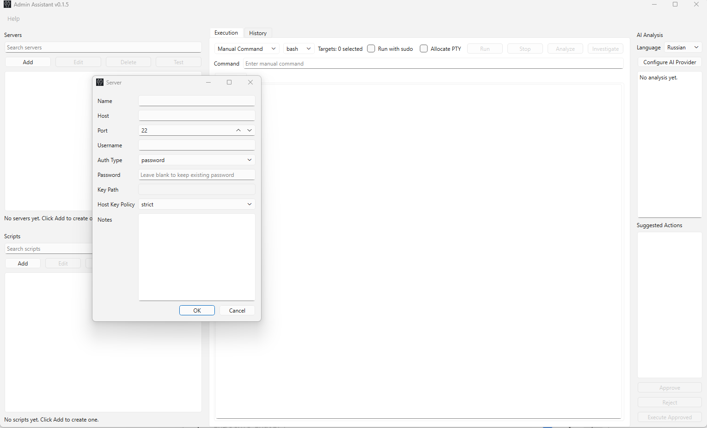
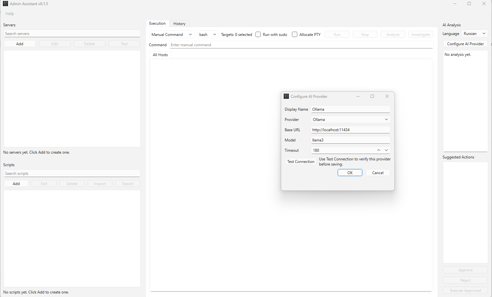

# Admin Assistant


AI-powered Windows desktop tool for server troubleshooting and incident investigation.

Admin Assistant is an AI-powered Windows desktop tool for server troubleshooting and incident investigation. It combines SSH command execution, reusable scripts, AI-assisted analysis, suggested actions, and lightweight incident workflows in a single PySide6 application.

## What It Does

Admin Assistant is designed for system administrators, DevOps engineers, and support teams who need a practical way to:

- connect to Linux servers over SSH
- run one-off commands or reusable scripts
- execute commands across multiple servers
- inspect output in a live console
- ask AI to explain failures in simple language
- review suggested actions and fix plans
- investigate incidents with a safe diagnostic workflow

## Key Features

- Server management with password or SSH key authentication
- Script library with `bash` and `sh` support
- Manual command execution and script execution on one or many servers
- Background execution with per-host output tabs and an `All Hosts` view
- Sudo and PTY support for privileged commands
- AI analysis with OpenAI, Ollama, or OpenAI-compatible providers
- Suggested actions with approve / reject / execute flow
- Structured fix plans with step-by-step remediation suggestions
- Incident Mode for safe AI-guided investigation
- Run history with output replay and AI linkage
- About dialog, System Info dialog, logs, and Windows packaging support

## Screenshots

Add screenshots to `assets/screenshots/` with the filenames below to populate this section on GitHub.

### Main Window



Core workspace with servers, scripts, execution console, and AI analysis in a single desktop view.

### Incident Analysis



Incident Mode investigation flow showing collected evidence and AI-guided analysis.

### Fix Plan


Structured remediation plan with step-by-step actions that can be reviewed before execution.

### History


Saved run history with output replay, per-target status, and linked AI context.

### Settings


Provider configuration and environment details for OpenAI, Ollama, and troubleshooting support.

## Installation

### Option 1: Windows Installer

If you already have a release build:

1. Download `AdminAssistant_Setup.exe` or the latest versioned installer.
2. Run the installer.
3. Launch **Admin Assistant** from the Start Menu or Desktop shortcut.

### Option 2: Run From Source

Requirements:

- Python 3.11 or newer
- Windows recommended for the first release

Install and run:

```powershell
python -m venv venv
.\venv\Scripts\Activate.ps1
python -m pip install -e .[dev]
$env:PYTHONPATH = "src"
python -m admin_assistant.main
```

## Quick Start

1. Open **Admin Assistant**.
2. Configure an AI provider in the right AI panel.
3. Add one or more servers in the left **Servers** section.
4. Optionally add reusable scripts in the left **Scripts** section.
5. Run a manual command or a script from the center **Execution** area.
6. Review output in the console.
7. Click **Analyze** to ask AI for explanation, next steps, suggested actions, and a fix plan.

## Main UI Areas

### Left Sidebar

**Servers**

- `Add` creates a new server entry
- `Edit` updates the selected server
- `Delete` removes the selected server
- `Test` checks SSH connectivity using the saved authentication settings

**Scripts**

- `Add` creates a reusable script
- `Edit` updates the selected script
- `Delete` removes the selected script

### Center Panel

**Execution tab**

- `Manual Command / Script` chooses whether you run a typed command or a saved script
- `Shell` chooses `bash` or `sh` for manual commands
- `Run with sudo` prefixes the command with `sudo -S`
- `Allocate PTY` requests a terminal when needed
- `Run` starts the selected action
- `Stop` is reserved for active-run control
- `Analyze` sends the latest completed run to the configured AI provider
- `Investigate` starts Incident Mode from a user-entered symptom

The console includes:

- `All Hosts` tab with prefixed lines such as `[web-01][stdout] ...`
- one tab per host
- run and host status lines

**History tab**

- browse previous runs
- inspect per-host status
- replay output from saved chunks
- review linked analyses and executed suggested actions

### Right Panel

The AI panel shows:

- summary
- probable causes
- evidence
- next steps
- suggested actions
- fix plans

It also includes:

- AI provider configuration
- language selection for AI explanations
- Approve / Reject / Execute Approved workflow

## AI Provider Configuration

Admin Assistant supports:

- OpenAI
- Ollama
- OpenAI-compatible endpoints

### OpenAI

Typical settings:

- Provider: `OpenAI`
- Base URL: `https://api.openai.com/v1`
- Model: `gpt-4o-mini`
- API key: required

Recommended setup:

1. Open **Configure AI Provider** in the AI panel.
2. Choose `OpenAI`.
3. Enter the base URL and model.
4. Paste your API key.
5. Click **Test Connection**.
6. Save the configuration.

### Ollama

Typical settings:

- Provider: `Ollama`
- Base URL: `http://127.0.0.1:11434`
- Model: `qwen2.5:7b`, `llama3`, `mistral`, or another installed model
- API key: not required

Recommended setup:

1. Start Ollama locally:

```powershell
ollama serve
```

2. Pull a model if needed:

```powershell
ollama pull qwen2.5:7b
```

3. In Admin Assistant, choose `Ollama` in the provider dialog.
4. Set the base URL to `http://127.0.0.1:11434`.
5. Enter the model name.
6. Click **Test Connection**.
7. Save the configuration.

## Adding a Server

1. In the **Servers** panel, click `Add`.
2. Enter:
   - server name
   - host or IP
   - port
   - username
   - authentication type
3. For password authentication, enter the SSH password.
4. For key authentication, choose the private key path and optional passphrase.
5. Save the server.
6. Use `Test` to verify connectivity.

Server secrets are stored through the OS credential system via `keyring`, not as plaintext in SQLite.

## Running Commands

### Manual Command

1. Select one or more servers.
2. In the Execution tab, keep `Manual Command` selected.
3. Enter a command such as:

```bash
uname -a
df -h
systemctl status sshd --no-pager
```

4. Optionally enable:
   - `Run with sudo`
   - `Allocate PTY`
5. Click `Run`.

### Saved Script

1. Create or select a script in the **Scripts** panel.
2. Select one or more servers.
3. Switch the Execution tab to `Script`.
4. Confirm the selected script name is shown.
5. Click `Run`.

## AI Analysis

After a run completes:

1. Click `Analyze`.
2. Admin Assistant loads saved run output from SQLite.
3. Output is redacted and truncated before being sent to the configured provider.
4. The AI response is validated and displayed in the AI panel.

AI analysis includes:

- a summary in simple language
- probable causes
- next steps
- suggested actions
- optional structured fix plan

Suggested actions are not auto-executed. They must be reviewed and approved first.

## Incident Mode

Incident Mode is a lightweight guided investigation flow.

How it works:

1. Click `Investigate`.
2. Enter a short symptom such as:
   - `SSH login failing for one host`
   - `Disk space alert on production`
   - `High CPU on app server`
3. Admin Assistant asks AI for a diagnostic plan.
4. Only safe, finite, read-only diagnostic commands are allowed to auto-run.
5. Evidence is collected through the existing execution engine.
6. A final incident analysis appears in the AI panel.

Incident Mode does **not** auto-run remediation. Fix actions still go through the normal approval workflow.

## Logs and Support

Admin Assistant writes its local database and log file under:

```text
%LOCALAPPDATA%\AdminAssistant
```

Important files:

- database: `%LOCALAPPDATA%\AdminAssistant\admin_assistant.db`
- log: `%LOCALAPPDATA%\AdminAssistant\admin_assistant.log`

Helpful support features:

- `Help -> System Info`
- `Copy Info`
- `Open Log Folder`

When reporting a bug, include:

- the app version
- System Info output
- the log file if possible
- the exact command or action that triggered the issue

## Security Note

Admin Assistant is designed to be practical, but it still runs powerful remote commands.

Please keep these points in mind:

- review commands before running them
- review AI-suggested actions before approval
- use sudo only when needed
- do not send secrets or private data to external AI providers unless that fits your security policy
- treat logs and command output as potentially sensitive operational data
- prefer read-only diagnostic commands during investigation

## Documentation

Additional guides:

- [Installation Guide](docs/installation.md)
- [Configuration Guide](docs/configuration.md)
- [Usage Guide](docs/usage.md)
- [Architecture Overview](docs/architecture.md)

## Author

**Dmitrii Fedorov**

- GitHub: [fedorovdo](https://github.com/fedorovdo)
- Contact: [fedorovkingisepp@gmail.com](mailto:fedorovkingisepp@gmail.com)
