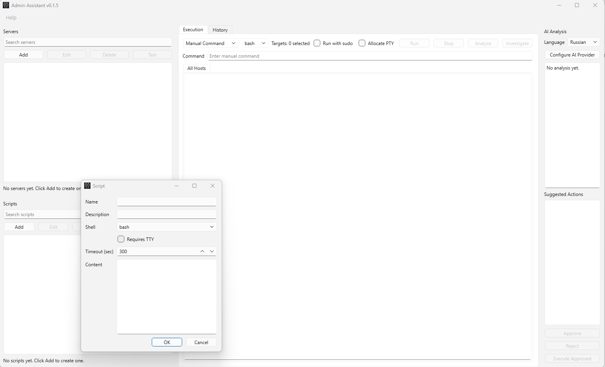
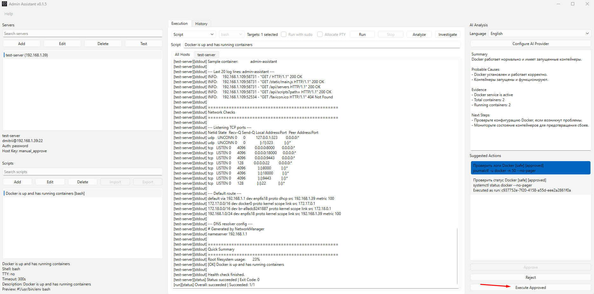
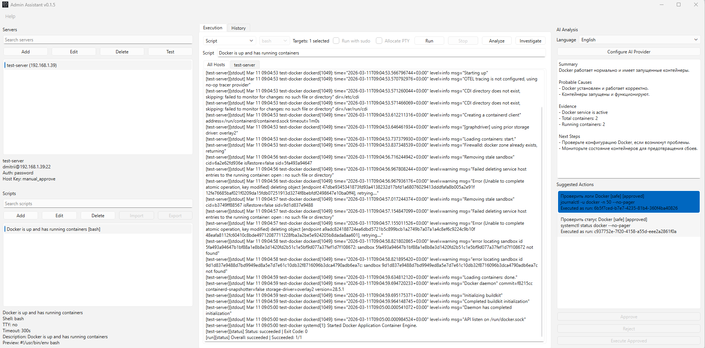

# Admin Assistant

docs: improve README for public product page


AI-powered desktop tool for SSH troubleshooting and system diagnostics.

Admin Assistant helps sysadmins and DevOps engineers connect to Linux hosts, run commands safely, inspect output in a structured console, and use AI to explain problems in plain language.

It combines SSH execution, reusable scripts, incident investigation, and approval-based AI suggestions in one Windows desktop app built for real troubleshooting workflows.

## Screenshots

### Main Window


Main workspace with servers, scripts, execution console, and AI analysis side by side.

### Incident Analysis


Incident Mode gathers safe diagnostics and turns the collected evidence into a readable analysis.

### Suggested Actions



AI-suggested follow-up actions stay reviewable and require explicit approval before execution.

### Server Configuration



Add SSH hosts with password or key authentication and keep credentials out of plaintext storage.

### AI Provider Configuration



Configure OpenAI, Ollama, or an OpenAI-compatible endpoint from the desktop UI.

## Quick Start

1. Download the latest installer from [GitHub Releases](https://github.com/fedorovdo/admin-assistant/releases).
2. Run `AdminAssistant_Setup.exe`.
3. Launch **Admin Assistant** from the Start Menu or Desktop shortcut.
4. Add a server in the **Servers** panel using your SSH host, username, and authentication method.
5. Click `Test` to verify SSH connectivity.
6. Run a manual command or saved script.
7. Click `Analyze` to get AI-based troubleshooting help.

## Features

- SSH command execution for one host or many hosts
- Reusable script library for common operational tasks
- Multi-host console with `All Hosts` and per-host output views
- AI analysis with OpenAI, Ollama, or OpenAI-compatible providers
- Suggested actions and structured fix plans
- Approval-based execution flow for AI-generated actions
- Incident Mode for guided, evidence-driven troubleshooting
- Run history with output replay and linked AI context

## Safety

Admin Assistant is built to help with troubleshooting without turning AI into an autonomous operator.

- The app does not execute dangerous AI-generated commands automatically.
- Suggested actions must be reviewed and explicitly approved by the user.
- Incident Mode auto-runs only finite, read-only diagnostic commands.
- Unsafe or inappropriate commands are filtered, including nested `ssh` commands and risky actions such as restarting `sshd`.
- Command output is treated as operational data and should be reviewed carefully before sending it to external AI providers.

## Windows SmartScreen Note

Windows SmartScreen may show a warning because the app is not code-signed yet.

If that happens:

1. Click `More info`.
2. Click `Run anyway`.

Only do this if you downloaded the installer from the official project release page.

## Development

Tech stack:

- Python
- PySide6
- Paramiko
- SQLite
- PyInstaller

Local run:

```powershell
python -m venv venv
.\venv\Scripts\Activate.ps1
python -m pip install -e .[dev]
$env:PYTHONPATH = "src"
python -m admin_assistant.main
```

## Documentation

- [Installation Guide](docs/installation.md)
- [Configuration Guide](docs/configuration.md)
- [Usage Guide](docs/usage.md)
- [Architecture Overview](docs/architecture.md)

## Author

**Dmitrii Fedorov**

- GitHub: [fedorovdo](https://github.com/fedorovdo)
- Contact: [fedorovkingisepp@gmail.com](mailto:fedorovkingisepp@gmail.com)
